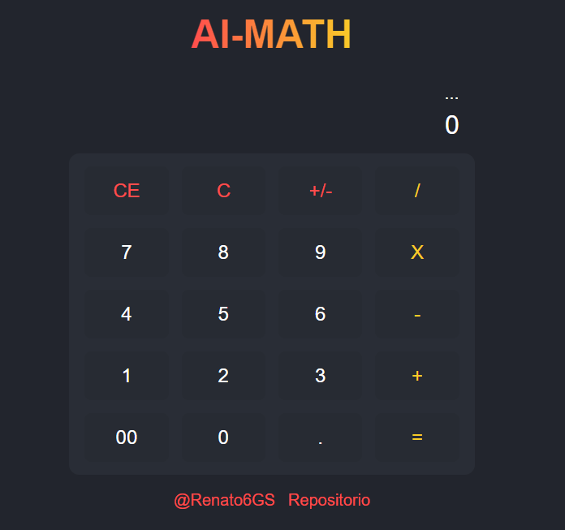

# CALCULADORA CON MACHINE LEARNING



Este proyecto es una calculadora básica que utiliza modelos de Machine Learning para realizar las operaciones de suma, resta, multiplicación y división. El FrontEnd está hecho con Vite y JavaScript, mientras que la API se creó con Flask Python. Los modelos han sido entrenado con Tensorflow y Keras.

Importante: Las operaciones no son exactas y tienen errores, el propósito del proyecto es familirializarse con el uso de estas herramientas de machine learning y comunicarlo entre una API y el FrontEnd.

## Instalación

### FrontEnd

Para instalar las dependencias necesarias, ejecuta el siguiente comando en tu terminal:

```bash
  npm install
```

### API Flask

Para instalarlo, necesita estar dentro de la carpeta de "flask_project_source" (o moverlo en otro lado del proyecto de FrontEnd) y ejecutar la siguiente instrucción:

```bash
  pip install -r requirements.txt
```

Hecho esto, ya solo tendrá que ejcutar el fronEnd con el comando `npm run dev` y la API con `python src/app.py`, y podrá ejecutar el proyecto.

## Arquitectura del proyecto


## Contribución

Si deseas contribuir a este proyecto, ¡estaré encantados de recibir pull requests!, tanto para mejorar la IA como el frontEnd.

## Licencia

Este proyecto está licenciado bajo la licencia MIT.
